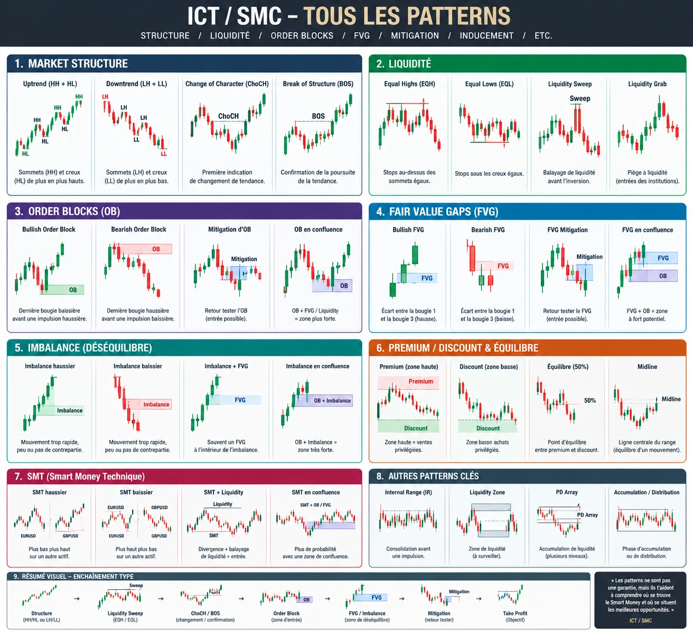

# Référentiel visuel des patterns ICT / SMC

Le bot ne « regarde » pas cette image : il lit les bougies en chiffres. Chaque pattern de
l'image est donc **traduit en règle de code**. Le tableau ci-dessous dit où se trouve chaque
pattern dans `src/moteur.js` et comment le bot l'utilise.

| # | Pattern de l'image | Où dans le code | Utilisation par le bot |
|---|---|---|---|
| 1 | Uptrend (HH + HL), Downtrend (LH + LL) | `pivots`, `lireUT` | Biais Monthly / Weekly / Daily, tendance H4 |
| 1 | Change of Character (CHoCH) | `structure` | Jambe H4, confirmation H1, MSS M15 |
| 1 | Break of Structure (BOS) | `structure` | Jambe H4 (le déplacement doit casser la structure) |
| 2 | Equal Highs / Equal Lows (EQH / EQL) | `niveauxPivots` | Liquidité à balayer ; « liquidité cumulée » |
| 2 | Liquidity Sweep | `balayagesBas`, `estExtreme` | **Obligatoire** : point A H4 et balayage M15 (mèche au-delà, clôture qui revient) |
| 2 | Liquidity Grab (piège à liquidité) | `balayagesBas` (cas `grab`) | Fausse cassure : clôture au-delà du niveau puis reprise en 3 bougies au plus, sans acceptation ; compte comme prise de liquidité |
| 2 | Inducement (piège interne) | `inducement` | +1 si un petit creux / sommet interne a été pris avant le vrai balayage |
| 3 | Bullish / Bearish Order Block | `zones` (type `OB`) | Zone H4 / HTF, entrée de secours si pas de FVG |
| 3 | Mitigation d'OB | `zones` (`touches`), entrée limite | L'ordre limite attend le retour dans la zone |
| 3 | OB en confluence | `zones` H4 + D1 / W1 | Points « zone H4 » et « zone HTF » |
| 4 | Bullish / Bearish FVG | `zones` (type `FVG`) | Entrée : **ordre limite au 50 % du FVG** du déplacement |
| 4 | FVG Mitigation | entrée limite | L'ordre est exécuté au retour dans le FVG |
| 4 | FVG en confluence (FVG + OB) | `obEtFvgSuperposes` | +1 si un OB (ou breaker) et un FVG (ou IFVG / BPR) H4 / H1 se chevauchent au balayage |
| 5 | Imbalance (déséquilibre) | déplacement (`corps` ≥ 1,5 × moyenne) + FVG | MSS M15 obligatoire avec déplacement ; déplacement H4 avec FVG |
| 5 | Imbalance en confluence | `zones` (FVG, BPR) | Points zone |
| 6 | Premium / Discount / Équilibre (50 %) | dealing range Daily, `retracement` | Achat en décote, vente en prime ; OTE 0,62-0,79 |
| 6 | Midline | `retracement` (0,5) | Le balayage M15 doit être au-delà de 0,5 de la jambe H4 |
| 7 | SMT haussier / baissier | `smt` | Points en plus si l'actif corrélé ne confirme pas le plus bas / plus haut |
| 7 | SMT + liquidité / en confluence | `smt` + balayage | La SMT est mesurée au moment du balayage |
| 8 | Internal Range | `lireUT` (range H4) | Range H4 non balayé = pas de trade |
| 8 | Liquidity Zone | `niveauxPivots`, sessions, périodes | Bords de range, lignes de tendance, sessions, PDH / PDL… |
| 8 | PD Array | `zones` + premium / discount | OB, breaker, FVG, IFVG, BPR classés par position |
| 8 | Accumulation / Distribution | point A H4 (`accumulation`) | Points « AMD H4 » |
| 9 | Enchaînement type | `analyserCote` | Structure → balayage → CHoCH / BOS → OB / FVG → mitigation (ordre limite) → TP |
